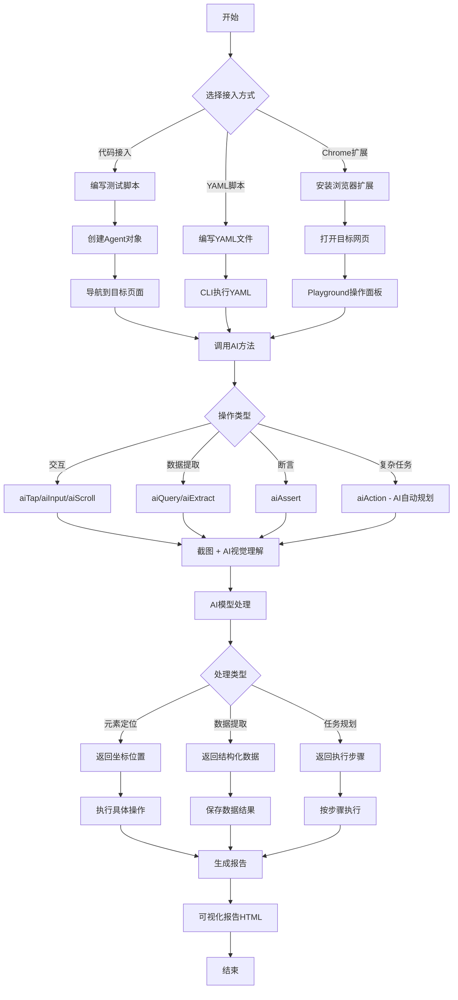
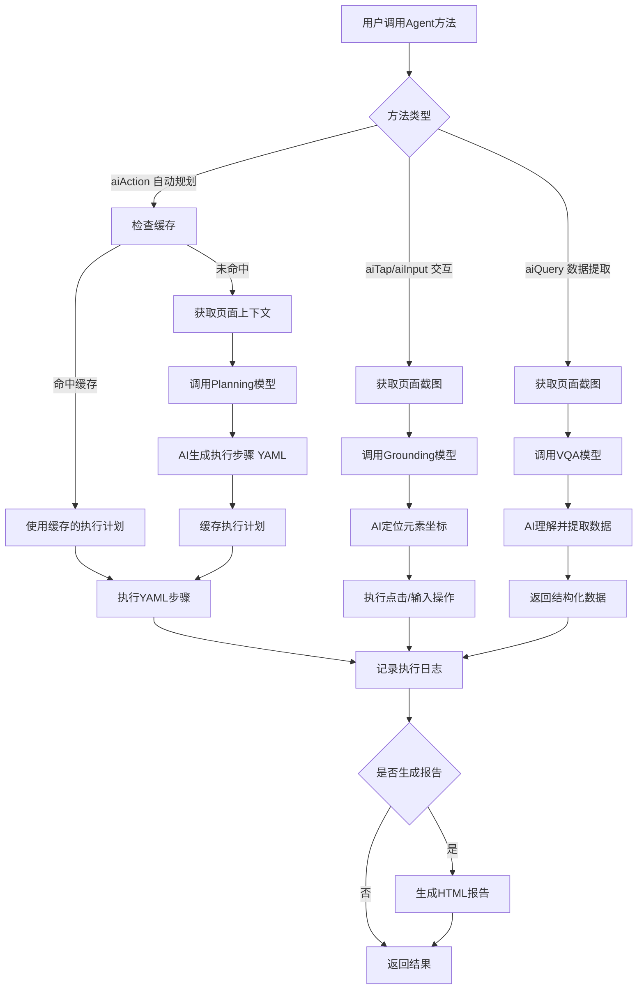
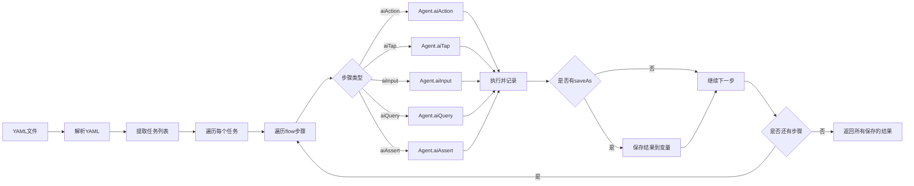
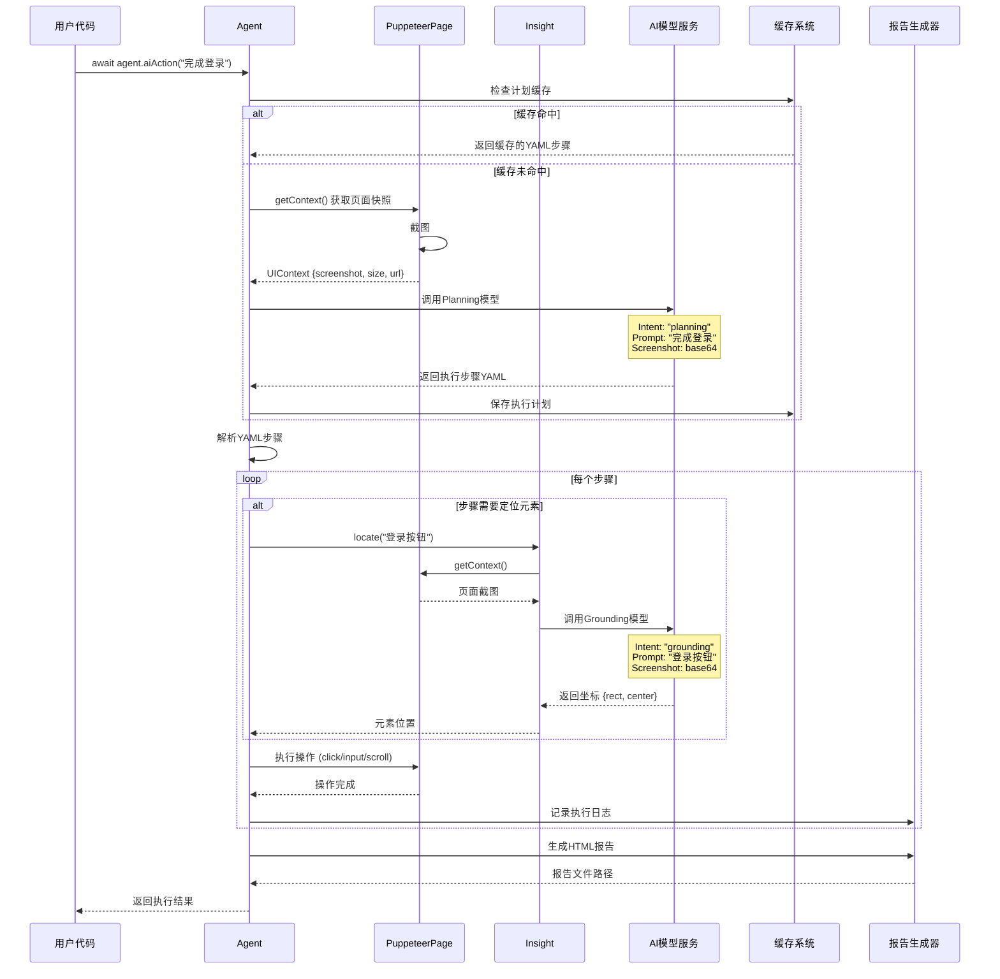
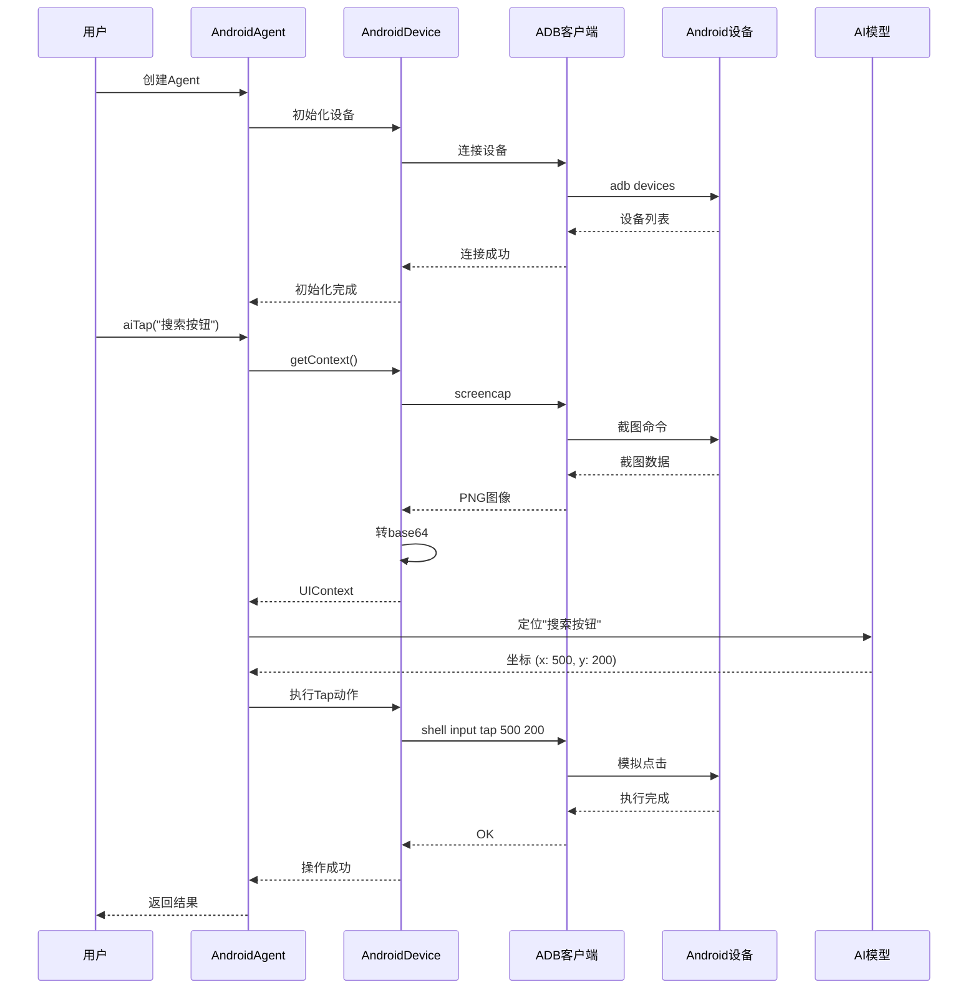
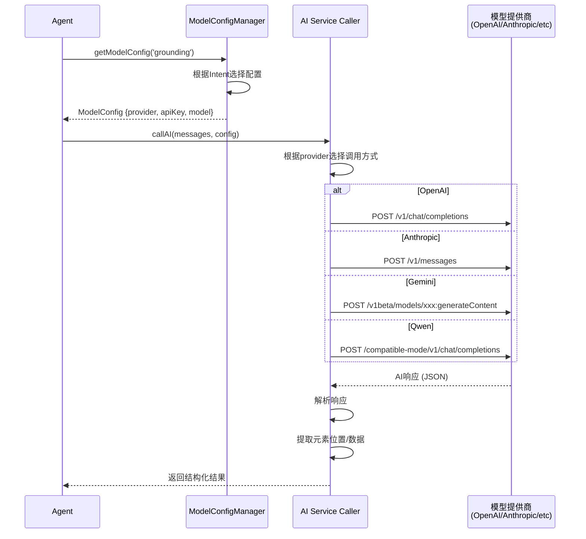

# Midscene.js 产品架构分析报告

> **报告编制**: 产品经理视角
> **项目版本**: 0.30.8
> **编制日期**: 2025-11-13
> **用途**: 项目组内部培训与讲解

---

## 📋 目录

1. [项目总览](#1-项目总览)
2. [产品架构图](#2-产品架构图)
3. [产品流程图](#3-产品流程图)
4. [时序图](#4-时序图)
5. [数据流图](#5-数据流图)
6. [产品功能清单](#6-产品功能清单)
7. [可自定义功能清单](#7-可自定义功能清单)
8. [AI模型架构分析](#8-ai模型架构分析)

---

## 1. 项目总览

### 1.1 产品定位

**Midscene.js** 是一个**基于视觉理解的AI驱动自动化测试框架**，核心创新点在于：

- ❌ **不依赖传统的 DOM 选择器** (CSS Selector, XPath)
- ✅ **使用自然语言描述**来定位和操作UI元素
- 🤖 **AI视觉模型理解界面**，实现跨平台自动化

### 1.2 核心价值主张

| 传统自动化测试                  | Midscene.js                   |
| ------------------------------- | ----------------------------- |
| 需要编写选择器 `.btn-login`   | 用自然语言 `"点击登录按钮"` |
| UI变化导致脚本失效              | AI理解界面语义，更健壮        |
| 需要学习Selenium/Playwright API | 简单的 `aiAction()` 方法    |
| 不同平台需要不同工具            | 统一API支持Web/Android/iOS    |
| 难以处理Canvas、图像验证码      | AI视觉模型直接"看"界面        |

### 1.3 技术特性

```
核心技术栈
├── 语言: TypeScript
├── 构建: pnpm Monorepo + Nx + Rslib
├── AI模型: OpenAI, Anthropic, Gemini, Qwen, UI-TARS
├── 平台集成: Puppeteer, Playwright, ADB, WebDriverAgent
└── 可视化: React + PixiJS
```

### 1.4 支持的平台

- 🌐 **Web**: 通过 Puppeteer/Playwright
- 📱 **Android**: 通过 ADB (Android Debug Bridge)
- 🍎 **iOS**: 通过 WebDriverAgent
- 🔌 **扩展模式**: Chrome Extension 桥接模式

---

## 2. 产品架构图

### 2.1 整体架构 (四层架构)

```
┌─────────────────────────────────────────────────────────────────┐
│                        应用层 (Apps Layer)                        │
│  ┌──────────┐  ┌──────────┐  ┌──────────┐  ┌──────────┐         │
│  │  Chrome  │  │Playground│  │  Report  │  │   Site   │         │
│  │Extension │  │   UI     │  │  Viewer  │  │   Docs   │         │
│  └──────────┘  └──────────┘  └──────────┘  └──────────┘         │
└─────────────────────────────────────────────────────────────────┘
                              ↓
┌─────────────────────────────────────────────────────────────────┐
│                   平台集成层 (Platform Layer)                     │
│  ┌──────────────┐  ┌──────────────┐  ┌──────────────┐          │
│  │  @midscene/  │  │  @midscene/  │  │  @midscene/  │          │
│  │     web      │  │   android    │  │     ios      │          │
│  │              │  │              │  │              │          │
│  │ Puppeteer    │  │     ADB      │  │ WebDriver    │          │
│  │ Playwright   │  │   Control    │  │   Agent      │          │
│  └──────────────┘  └──────────────┘  └──────────────┘          │
└─────────────────────────────────────────────────────────────────┘
                              ↓
┌─────────────────────────────────────────────────────────────────┐
│                    核心引擎层 (Core Engine)                       │
│  ┌──────────────────────────────────────────────────────────┐   │
│  │                   @midscene/core                          │   │
│  │  ┌──────────┐  ┌──────────┐  ┌──────────┐  ┌─────────┐  │   │
│  │  │  Agent   │  │ Insight  │  │ Executor │  │  YAML   │  │   │
│  │  │  智能代理  │  │ 数据提取  │  │ 任务执行  │  │ 脚本解析 │  │   │
│  │  └──────────┘  └──────────┘  └──────────┘  └─────────┘  │   │
│  │  ┌────────────────────────────────────────────────────┐  │   │
│  │  │           AI Model Integration (多模型支持)         │  │   │
│  │  │  OpenAI | Anthropic | Gemini | Qwen | UI-TARS     │  │   │
│  │  └────────────────────────────────────────────────────┘  │   │
│  └──────────────────────────────────────────────────────────┘   │
└─────────────────────────────────────────────────────────────────┘
                              ↓
┌─────────────────────────────────────────────────────────────────┐
│                   基础设施层 (Infrastructure)                     │
│  ┌────────────┐  ┌────────────┐  ┌────────────┐  ┌─────────┐   │
│  │   Device   │  │   Cache    │  │   Logger   │  │  Image  │   │
│  │ Interface  │  │   System   │  │   System   │  │   Proc  │   │
│  └────────────┘  └────────────┘  └────────────┘  └─────────┘   │
│                     @midscene/shared                             │
└─────────────────────────────────────────────────────────────────┘
```

### 2.2 核心模块关系图

```
                      ┌─────────────────┐
                      │      Agent      │
                      │   (智能代理)      │
                      └────────┬────────┘
                               │ 协调
              ┌────────────────┼────────────────┐
              ↓                ↓                ↓
       ┌──────────┐     ┌──────────┐    ┌──────────┐
       │ Insight  │     │ Executor │    │Interface │
       │ (洞察)   │     │ (执行器) │    │(设备接口)│
       └─────┬────┘     └────┬─────┘    └────┬─────┘
             │               │               │
             ↓               ↓               ↓
        ┌────────────────────────────────────────┐
        │          AI Model Layer                │
        │  (按意图选择不同模型)                    │
        │  Intent: Planning | Grounding | VQA    │
        └────────────────────────────────────────┘
```

### 2.3 包依赖关系图

```
应用层 Apps
  ├── chrome-extension ──→ @midscene/web
  ├── playground ──────→ @midscene/visualizer
  ├── report ──────────→ @midscene/visualizer
  └── site (文档)

工具层 Tools
  ├── @midscene/cli ───────→ @midscene/core + @midscene/web + @midscene/android + @midscene/ios
  ├── @midscene/mcp ───────→ @midscene/core + @midscene/web
  └── @midscene/visualizer ─→ @midscene/core

平台层 Platforms
  ├── @midscene/web ───────→ @midscene/core + @midscene/playground
  ├── @midscene/android ───→ @midscene/core
  └── @midscene/ios ───────→ @midscene/core + @midscene/webdriver

核心层 Core
  ├── @midscene/core ──────→ @midscene/shared + @midscene/recorder
  ├── @midscene/recorder ──→ (standalone)
  └── @midscene/shared ────→ (foundation)
```

---

## 3. 产品流程图

### 3.1 用户使用流程 (典型Web自动化场景)



### 3.2 核心执行流程 (Agent内部)



### 3.3 YAML脚本执行流程



---

## 4. 时序图

### 4.1 Web自动化完整时序



### 4.2 Android自动化时序



### 4.3 AI模型调用时序



---

## 5. 数据流图

### 5.1 整体数据流

```
┌──────────────────────────────────────────────────────────────┐
│  输入层 (Input)                                                │
│  ┌──────────────┐  ┌──────────────┐  ┌──────────────┐       │
│  │ 用户代码      │  │  YAML脚本    │  │  UI操作      │       │
│  │ agent.aiTap()│  │  tasks: []   │  │ (Playground) │       │
│  └──────┬───────┘  └──────┬───────┘  └──────┬───────┘       │
└─────────┼──────────────────┼──────────────────┼──────────────┘
          │                  │                  │
          └──────────────────┼──────────────────┘
                             ↓
┌──────────────────────────────────────────────────────────────┐
│  处理层 (Processing)                                           │
│                                                                │
│  ┌────────────────────────────────────────────────────────┐  │
│  │  Agent 协调中心                                         │  │
│  │  1. 解析用户意图                                        │  │
│  │  2. 选择执行策略 (缓存/新建)                            │  │
│  │  3. 调度各个模块                                        │  │
│  └───────┬───────────────────────────────────────┬────────┘  │
│          ↓                                       ↓            │
│  ┌──────────────┐                        ┌──────────────┐    │
│  │ TaskCache    │                        │ Insight      │    │
│  │ 检查缓存      │                        │ AI数据提取    │    │
│  └──────┬───────┘                        └──────┬───────┘    │
│         ↓                                       ↓            │
│  ┌─────────────────────────────────────────────────────┐    │
│  │         TaskExecutor 任务执行器                      │    │
│  │  1. 规划任务步骤                                     │    │
│  │  2. 定位UI元素                                       │    │
│  │  3. 执行操作                                         │    │
│  │  4. 提取数据                                         │    │
│  └────────┬────────────────────────────────────┬────────┘    │
│           │                                    │              │
│           ↓                                    ↓              │
│  ┌──────────────────┐              ┌──────────────────┐      │
│  │  AI Model Layer  │              │ Device Interface │      │
│  │  多意图模型调用   │              │  设备操作抽象     │      │
│  └────────┬─────────┘              └─────────┬────────┘      │
└───────────┼──────────────────────────────────┼───────────────┘
            │                                  │
            ↓                                  ↓
┌──────────────────────────────────────────────────────────────┐
│  外部依赖层 (External)                                         │
│  ┌──────────────┐                    ┌──────────────┐        │
│  │  AI服务商    │                    │  目标设备     │        │
│  │  OpenAI/等   │                    │ Browser/手机  │        │
│  └──────┬───────┘                    └──────┬───────┘        │
└─────────┼──────────────────────────────────┼────────────────┘
          │                                  │
          └──────────────┬───────────────────┘
                         ↓
┌──────────────────────────────────────────────────────────────┐
│  输出层 (Output)                                               │
│  ┌──────────────┐  ┌──────────────┐  ┌──────────────┐       │
│  │  执行结果    │  │  HTML报告     │  │  缓存数据     │       │
│  │  返回数据    │  │  可视化展示   │  │  YAML计划     │       │
│  └──────────────┘  └──────────────┘  └──────────────┘       │
└──────────────────────────────────────────────────────────────┘
```

### 5.2 核心数据结构

```typescript
// 1. UI上下文 (UIContext) - 页面快照
{
  screenshotBase64: string,        // 页面截图 (base64)
  size: { width, height },         // 屏幕尺寸
  url?: string,                    // 当前URL (Web)
  elementTree?: ElementNode[],     // DOM树 (可选)
  extra?: any                      // 平台特定数据
}

// 2. 执行计划 (PlanningAction) - AI生成的步骤
{
  type: 'Tap' | 'Input' | 'Scroll' | 'Assert' | ...,
  thought: string,                 // AI的思考过程
  param: {
    locate?: {
      prompt: string,              // 元素描述
      rect?: Rect,                 // 位置 (执行时填充)
      center?: [x, y]
    },
    value?: string,                // 输入值
    assertion?: string             // 断言条件
  }
}

// 3. 元素位置 (LocateResult)
{
  rect: {                          // 矩形边界
    left: number,
    top: number,
    width: number,
    height: number
  },
  center: [x, y]                   // 中心坐标
}

// 4. 执行日志 (ExecutionDump)
{
  groupName: string,               // 任务组名称
  executions: [                    // 执行记录列表
    {
      title: string,               // 任务标题
      context: UIContext,          // 执行时上下文
      tasks: [                     // 子任务列表
        {
          type: string,            // 任务类型
          status: 'success' | 'fail',
          param: any,              // 参数
          thought: string,         // AI思考
          errorMessage?: string    // 错误信息
        }
      ]
    }
  ]
}

// 5. AI模型配置 (ModelConfig)
{
  provider: 'openai' | 'anthropic' | 'gemini' | 'qwen',
  apiKey: string,
  baseURL?: string,
  model: string,                   // 模型名称
  temperature?: number,
  maxTokens?: number,
  vlMode: boolean,                 // 是否为视觉模型
  intent: 'VQA' | 'planning' | 'grounding' | 'default'
}
```

### 5.3 数据流转示例 (aiAction执行)

```
用户调用
  ↓
agent.aiAction("完成用户登录")
  ↓
┌─────────────────────────────────────────┐
│ 步骤1: 检查缓存                          │
│  输入: "完成用户登录"                     │
│  输出: 未命中缓存 → 继续                  │
└─────────────────────────────────────────┘
  ↓
┌─────────────────────────────────────────┐
│ 步骤2: 获取页面上下文                    │
│  输入: page对象                          │
│  输出: UIContext {                       │
│    screenshotBase64: "data:image...",   │
│    size: {width: 1920, height: 1080},   │
│    url: "https://example.com/login"     │
│  }                                       │
└─────────────────────────────────────────┘
  ↓
┌─────────────────────────────────────────┐
│ 步骤3: 调用Planning模型生成计划           │
│  输入: {                                 │
│    prompt: "完成用户登录",               │
│    screenshot: UIContext.screenshot,     │
│    intent: "planning"                    │
│  }                                       │
│  ↓ AI处理                                │
│  输出: YAML格式执行计划                   │
│  ```yaml                                 │
│  flow:                                   │
│    - aiTap:                             │
│        locate: "用户名输入框"            │
│    - aiInput:                           │
│        locate: "用户名输入框"            │
│        value: "testuser"                │
│    - aiInput:                           │
│        locate: "密码输入框"              │
│        value: "password"                │
│    - aiTap: "登录按钮"                  │
│  ```                                     │
└─────────────────────────────────────────┘
  ↓
┌─────────────────────────────────────────┐
│ 步骤4: 保存计划到缓存                    │
│  输入: {                                 │
│    type: 'plan',                        │
│    prompt: "完成用户登录",               │
│    yamlWorkflow: "..."                  │
│  }                                       │
└─────────────────────────────────────────┘
  ↓
┌─────────────────────────────────────────┐
│ 步骤5: 执行YAML步骤                      │
│  遍历每个步骤:                           │
│    1. aiTap "用户名输入框"               │
│       → 调用Grounding模型定位            │
│       → 返回坐标 (100, 200)              │
│       → 执行点击操作                     │
│    2. aiInput "用户名输入框" = "test"    │
│       → 复用上一步定位结果               │
│       → 执行输入操作                     │
│    3. aiInput "密码输入框" = "pass"      │
│       → 定位新元素 (100, 260)            │
│       → 执行输入操作                     │
│    4. aiTap "登录按钮"                   │
│       → 定位按钮 (150, 320)              │
│       → 执行点击操作                     │
└─────────────────────────────────────────┘
  ↓
┌─────────────────────────────────────────┐
│ 步骤6: 生成执行报告                      │
│  输入: ExecutionDump                     │
│  输出: HTML报告文件                       │
│  路径: ./midscene_run/report_xxx.html   │
└─────────────────────────────────────────┘
  ↓
返回执行结果给用户
```

---

## 6. 产品功能清单

### 6.1 核心功能模块

#### 6.1.1 交互操作类

| 功能     | API方法                           | 说明                     | 使用场景             |
| -------- | --------------------------------- | ------------------------ | -------------------- |
| 智能点击 | `aiTap(prompt)`                 | AI识别元素并点击         | 点击按钮、链接、图标 |
| 智能输入 | `aiInput(prompt, {value})`      | AI定位输入框并输入       | 填写表单、搜索框     |
| 智能滚动 | `aiScroll(direction, distance)` | 滚动页面                 | 加载更多内容         |
| 自动规划 | `aiAction(task)`                | AI自动规划并执行复杂任务 | "完成购物流程"       |
| 等待条件 | `aiWaitFor(condition, timeout)` | 等待指定条件满足         | 等待加载完成         |

#### 6.1.2 数据提取类

| 功能     | API方法                 | 说明           | 使用场景           |
| -------- | ----------------------- | -------------- | ------------------ |
| 查询数据 | `aiQuery<T>(demand)`  | 提取单个数据   | 获取用户名、价格   |
| 布尔判断 | `aiBoolean(question)` | 返回是/否      | "是否显示错误提示" |
| 批量提取 | `aiExtract(schema)`   | 提取结构化数据 | 提取商品列表       |
| 元素定位 | `aiLocate(prompt)`    | 获取元素坐标   | 获取元素位置信息   |

#### 6.1.3 质量保障类

| 功能       | API方法                 | 说明               | 使用场景           |
| ---------- | ----------------------- | ------------------ | ------------------ |
| 断言验证   | `aiAssert(assertion)` | AI判断断言是否成立 | "页面显示成功提示" |
| 可视化报告 | 自动生成                | HTML格式测试报告   | 查看执行过程       |
| 执行回放   | 报告内置                | 回放测试过程       | 调试失败用例       |
| 截图对比   | 报告功能                | 每步截图展示       | 查看UI变化         |

#### 6.1.4 脚本化能力

| 功能     | 说明                | 使用场景        |
| -------- | ------------------- | --------------- |
| YAML脚本 | 声明式脚本          | 批量测试、CI/CD |
| CLI工具  | `midscene run`    | 命令行执行      |
| 变量系统 | `saveAs` 保存结果 | 数据传递        |
| 条件执行 | YAML条件语法        | 分支逻辑        |

### 6.2 平台支持功能

#### 6.2.1 Web平台

| 功能           | 实现方式                     | 说明                |
| -------------- | ---------------------------- | ------------------- |
| Puppeteer集成  | `@midscene/web/puppeteer`  | 支持Chrome/Chromium |
| Playwright集成 | `@midscene/web/playwright` | 支持多浏览器        |
| 桥接模式       | Chrome Extension             | 无代码操作现有页面  |
| 静态页面分析   | `StaticPageAgent`          | 分析HTML文件        |

#### 6.2.2 Android平台

| 功能        | 实现方式       | 说明            |
| ----------- | -------------- | --------------- |
| ADB设备控制 | `appium-adb` | 连接真机/模拟器 |
| 应用启动    | `startApp()` | 启动指定应用    |
| 输入法控制  | IME策略        | 支持中文输入    |
| Playground  | Web UI         | 可视化操作      |

#### 6.2.3 iOS平台

| 功能       | 实现方式        | 说明          |
| ---------- | --------------- | ------------- |
| 模拟器支持 | WebDriverAgent  | iOS Simulator |
| 真机支持   | WebDriverAgent  | 需签名配置    |
| 应用管理   | `launchApp()` | 启动/关闭应用 |

### 6.3 AI能力功能

#### 6.3.1 视觉理解

| 能力       | 说明                     | 技术实现     |
| ---------- | ------------------------ | ------------ |
| 元素识别   | 识别按钮、输入框、图标等 | VLM视觉模型  |
| 文字理解   | OCR + 语义理解           | 多模态模型   |
| 布局分析   | 理解页面结构             | 空间关系推理 |
| 图像验证码 | 识别验证码               | 视觉+推理    |

#### 6.3.2 智能规划

| 能力         | 说明                | 技术实现    |
| ------------ | ------------------- | ----------- |
| 任务分解     | 复杂任务拆分为步骤  | LLM规划能力 |
| 执行计划生成 | 生成YAML执行流程    | Prompt工程  |
| 上下文理解   | 理解当前状态        | 多轮对话    |
| 错误恢复     | 失败后重试/调整策略 | 反馈循环    |

#### 6.3.3 数据提取

| 能力       | 说明              | 技术实现   |
| ---------- | ----------------- | ---------- |
| 结构化提取 | 提取JSON/数组数据 | Schema约束 |
| 语义匹配   | 模糊查询数据      | 向量相似度 |
| 表格提取   | 提取表格数据      | 表格理解   |
| 动态数据   | 提取变化的数据    | 实时分析   |

### 6.4 工程化功能

#### 6.4.1 缓存系统

| 功能         | 说明                            | 配置                    |
| ------------ | ------------------------------- | ----------------------- |
| 执行计划缓存 | 缓存aiAction生成的YAML          | `MIDSCENE_CACHE=true` |
| 缓存策略     | read-only/write-only/read-write | `strategy` 选项       |
| 缓存失效     | 相似度匹配                      | 自动判断                |

#### 6.4.2 报告系统

| 功能     | 说明           | 输出           |
| -------- | -------------- | -------------- |
| HTML报告 | 可视化报告     | `.html` 文件 |
| JSON数据 | 原始执行数据   | `.json` 文件 |
| 时间线   | 执行时间线展示 | 报告内置       |
| 截图归档 | 每步截图保存   | base64嵌入     |

#### 6.4.3 集成能力

| 功能                | 说明                   | 使用方式                            |
| ------------------- | ---------------------- | ----------------------------------- |
| CI/CD集成           | Jenkins/GitHub Actions | CLI执行                             |
| Playwright Reporter | Playwright测试报告     | `@midscene/web/playwright-report` |
| MCP协议             | Claude Desktop集成     | `@midscene/mcp`                   |
| API接口             | 远程调用               | HTTP接口                            |

### 6.5 开发者工具

| 工具       | 说明                 | 用途       |
| ---------- | -------------------- | ---------- |
| Playground | 可视化操作面板       | 调试、演示 |
| Visualizer | 可视化组件库         | 报告展示   |
| CLI工具    | 命令行工具           | 批量执行   |
| Chrome扩展 | 浏览器扩展           | 录制、回放 |
| 调试日志   | `DEBUG=midscene:*` | 问题排查   |

---

## 7. 可自定义功能清单

### 7.1 AI模型配置

#### 7.1.1 全局配置 (环境变量)

```bash
# 选择默认模型
MIDSCENE_MODEL_NAME=gpt-4o                    # 或 qwen-vl-max, gemini-2.0-flash

# OpenAI配置
OPENAI_API_KEY=sk-xxx
OPENAI_BASE_URL=https://api.openai.com/v1    # 可自定义代理

# Anthropic配置
ANTHROPIC_API_KEY=sk-ant-xxx

# Google Gemini配置
GEMINI_API_KEY=xxx

# Qwen配置
QWEN_API_KEY=sk-xxx
QWEN_BASE_URL=https://dashscope.aliyuncs.com/compatible-mode/v1
```

#### 7.1.2 按意图配置 (代码级)

```typescript
const agent = await PuppeteerAgent.create(page, {
  modelConfig: ({ intent }) => {
    // 根据不同意图返回不同配置
    if (intent === 'planning') {
      // 规划任务用大模型
      return {
        provider: 'openai',
        model: 'gpt-4o',
        apiKey: process.env.OPENAI_API_KEY,
        temperature: 0.7
      };
    } else if (intent === 'grounding') {
      // 元素定位用视觉模型
      return {
        provider: 'qwen',
        model: 'qwen-vl-max',
        apiKey: process.env.QWEN_API_KEY,
        baseURL: process.env.QWEN_BASE_URL
      };
    } else if (intent === 'VQA') {
      // 数据提取用快速模型
      return {
        provider: 'gemini',
        model: 'gemini-2.0-flash-exp',
        apiKey: process.env.GEMINI_API_KEY
      };
    }
    // default
    return {
      provider: 'openai',
      model: 'gpt-4o',
      apiKey: process.env.OPENAI_API_KEY
    };
  }
});
```

**支持的Intent类型:**

1. `planning` - 任务规划 (aiAction生成执行步骤)
2. `grounding` - 元素定位 (aiTap/aiInput定位元素)
3. `VQA` - 数据提取 (aiQuery提取数据)
4. `default` - 默认配置

### 7.2 设备接口自定义

#### 7.2.1 扩展设备接口

```typescript
// 自定义桌面应用支持
class DesktopDevice implements AbstractInterface {
  interfaceType = 'desktop';

  // 定义可用操作
  async actionSpace(): Promise<DeviceAction[]> {
    return [
      {
        type: 'Tap',
        execute: async (param) => {
          // 使用robotjs等工具实现点击
          robot.moveMouse(param.element.center[0], param.element.center[1]);
          robot.mouseClick();
        }
      },
      {
        type: 'KeyboardPress',
        execute: async (param) => {
          robot.keyTap(param.key);
        }
      }
      // ... 更多自定义操作
    ];
  }

  // 获取屏幕上下文
  async getContext(): Promise<UIContext> {
    const screenshot = robot.screen.capture();
    return {
      screenshotBase64: imageToBase64(screenshot),
      size: robot.getScreenSize()
    };
  }

  // ... 其他必需方法
}
```

#### 7.2.2 自定义操作动作

```typescript
// 添加自定义操作类型
const customActions: DeviceAction[] = [
  {
    type: 'DoubleClick',
    execute: async (param) => {
      await page.mouse.click(param.center[0], param.center[1], { clickCount: 2 });
    }
  },
  {
    type: 'Hover',
    execute: async (param) => {
      await page.mouse.move(param.center[0], param.center[1]);
    }
  },
  {
    type: 'Drag',
    execute: async (param) => {
      const { from, to } = param;
      await page.mouse.move(from[0], from[1]);
      await page.mouse.down();
      await page.mouse.move(to[0], to[1]);
      await page.mouse.up();
    }
  }
];
```

### 7.3 缓存策略自定义

#### 7.3.1 本地文件缓存 (默认)

```typescript
const agent = await PuppeteerAgent.create(page, {
  cache: {
    enabled: true,
    id: 'my-test-suite',              // 缓存标识
    strategy: 'read-write',           // 读写策略
    filePath: './cache/my-cache.json' // 自定义路径
  }
});
```

#### 7.3.2 自定义缓存策略 (Redis示例)

```typescript
class RedisCacheStrategy implements CacheStrategy {
  private redis: Redis;

  constructor(redisUrl: string) {
    this.redis = new Redis(redisUrl);
  }

  async get(key: string): Promise<any> {
    const value = await this.redis.get(key);
    return value ? JSON.parse(value) : null;
  }

  async set(key: string, value: any, ttl?: number): Promise<void> {
    const serialized = JSON.stringify(value);
    if (ttl) {
      await this.redis.setex(key, ttl, serialized);
    } else {
      await this.redis.set(key, serialized);
    }
  }

  // ... 其他方法
}

// 使用自定义缓存
const agent = new Agent(page, {
  cacheStrategy: new RedisCacheStrategy('redis://localhost:6379')
});
```

### 7.4 报告生成自定义

#### 7.4.1 自定义报告样式

```typescript
// 自定义报告HTML模板
function customReportTemplate(dumpData: ExecutionDump): string {
  return `
    <!DOCTYPE html>
    <html>
      <head>
        <title>自定义测试报告</title>
        <link rel="stylesheet" href="/custom-styles.css">
      </head>
      <body>
        <div id="report-container">
          <h1>${dumpData.groupName}</h1>
          <div class="summary">
            总执行: ${dumpData.executions.length}
            成功: ${countSuccess(dumpData)}
            失败: ${countFailed(dumpData)}
          </div>
          ${renderExecutions(dumpData.executions)}
        </div>
        <script>
          window.reportData = ${JSON.stringify(dumpData)};
        </script>
      </body>
    </html>
  `;
}

// 注入自定义报告生成器
agent.setReportGenerator(customReportTemplate);
```

#### 7.4.2 报告数据上传

```typescript
const agent = await PuppeteerAgent.create(page, {
  generateReport: true,
  onDumpUpdate: async (dumpData) => {
    // 实时上传报告数据到服务器
    await fetch('https://your-report-server.com/api/reports', {
      method: 'POST',
      headers: { 'Content-Type': 'application/json' },
      body: JSON.stringify({
        projectId: 'my-project',
        timestamp: Date.now(),
        data: dumpData
      })
    });
  }
});
```

### 7.5 Prompt自定义

#### 7.5.1 自定义系统提示词

```typescript
// 修改元素定位的系统提示词
import { systemPromptToLocateElement } from '@midscene/core/ai-model';

// 覆盖默认提示词
function customLocatePrompt(userPrompt: string): string {
  return `
你是一个专业的UI自动化测试专家。
当前任务: 定位用户描述的元素 "${userPrompt}"

请分析截图,找到最匹配的元素,返回其位置坐标。

注意事项:
- 优先匹配文本内容
- 考虑元素的视觉层级
- 返回最明显、最可操作的元素

返回格式: JSON
  `;
}

// 在Agent配置中使用
const agent = await PuppeteerAgent.create(page, {
  customPrompts: {
    locate: customLocatePrompt
  }
});
```

#### 7.5.2 添加上下文信息

```typescript
// 为AI操作添加全局上下文
await agent.setAIActionContext(`
当前测试环境: 生产环境
用户角色: 管理员
测试目标: 验证订单流程
注意事项:
  - 不要删除真实数据
  - 操作前需要确认
  - 记录所有关键步骤
`);

// 后续的AI操作都会考虑这个上下文
await agent.aiAction('创建测试订单');
```

### 7.6 UI界面自定义

#### 7.6.1 自定义Playground

```tsx
import { UniversalPlayground } from '@midscene/visualizer';

function MyCustomPlayground() {
  return (
    <UniversalPlayground
      branding={{
        title: '我的自动化平台',
        logo: '/my-logo.png',
        primaryColor: '#1890ff',
        footer: '© 2025 My Company'
      }}
      config={{
        defaultExecutionType: 'local',
        showAdvancedOptions: true,
        enableCache: true,
        allowedActions: ['aiTap', 'aiInput', 'aiQuery'],  // 限制可用操作
        customActions: [
          {
            name: '批量操作',
            icon: 'batch',
            handler: async (agent) => {
              // 自定义批量操作逻辑
            }
          }
        ]
      }}
    />
  );
}
```

#### 7.6.2 自定义报告组件

```tsx
import { ReportData } from '@midscene/core';
import { Timeline, Screenshot } from '@midscene/visualizer';

function CustomReport({ data }: { data: ReportData }) {
  return (
    <div className="custom-report">
      <header>
        <h1>{data.groupName}</h1>
        <div className="metrics">
          <Metric label="总耗时" value={calculateDuration(data)} />
          <Metric label="AI调用次数" value={countAICalls(data)} />
          <Metric label="成功率" value={calculateSuccessRate(data)} />
        </div>
      </header>

      <Timeline data={data.executions} />

      <div className="executions">
        {data.executions.map(execution => (
          <ExecutionCard key={execution.id} data={execution} />
        ))}
      </div>
    </div>
  );
}
```

### 7.7 插件系统 (扩展点)

#### 7.7.1 生命周期钩子

```typescript
const agent = await PuppeteerAgent.create(page, {
  // 任务开始前
  beforeTask: async (taskInfo) => {
    console.log(`开始执行: ${taskInfo.title}`);
    // 可以修改任务配置、记录日志等
  },

  // 任务完成后
  afterTask: async (taskInfo, result) => {
    console.log(`完成执行: ${taskInfo.title}, 结果:`, result);
    // 发送通知、上传数据等
  },

  // AI调用前
  beforeAICall: async (messages, config) => {
    // 记录AI调用、修改提示词等
    console.log('AI调用:', config.intent);
  },

  // AI调用后
  afterAICall: async (messages, config, response) => {
    // 统计token消耗、分析响应等
    console.log('AI响应token:', response.usage.totalTokens);
  },

  // 操作执行前
  beforeAction: async (action) => {
    console.log(`准备执行操作: ${action.type}`);
  },

  // 操作执行后
  afterAction: async (action, result) => {
    console.log(`操作完成: ${action.type}`);
  }
});
```

#### 7.7.2 自定义中间件

```typescript
// 添加重试中间件
function retryMiddleware(maxRetries = 3) {
  return {
    beforeAction: async (action, context) => {
      context.retryCount = 0;
    },

    onActionError: async (action, error, context) => {
      if (context.retryCount < maxRetries) {
        context.retryCount++;
        console.log(`重试 ${context.retryCount}/${maxRetries}`);
        return 'retry';  // 指示框架重试
      }
      return 'throw';  // 抛出错误
    }
  };
}

// 添加日志中间件
function loggingMiddleware(logService) {
  return {
    afterAction: async (action, result) => {
      await logService.log({
        type: action.type,
        timestamp: Date.now(),
        result: result
      });
    }
  };
}

// 使用中间件
const agent = await PuppeteerAgent.create(page, {
  middlewares: [
    retryMiddleware(3),
    loggingMiddleware(myLogService)
  ]
});
```

### 7.8 环境变量配置

#### 完整配置清单

```bash
# ===== AI模型配置 =====
# 默认模型
MIDSCENE_MODEL_NAME=gpt-4o
MIDSCENE_VL_MODE=vlm                          # vlm | vlm-ui-tars

# OpenAI
OPENAI_API_KEY=sk-xxx
OPENAI_BASE_URL=https://api.openai.com/v1
OPENAI_MAX_TOKENS=4096

# Anthropic
ANTHROPIC_API_KEY=sk-ant-xxx

# Google Gemini
GEMINI_API_KEY=xxx

# Qwen (通义千问)
QWEN_API_KEY=sk-xxx
QWEN_BASE_URL=https://dashscope.aliyuncs.com/compatible-mode/v1

# 按意图配置 (VQA专用)
MIDSCENE_VQA_MODEL_NAME=gemini-2.0-flash-exp
MIDSCENE_VQA_OPENAI_API_KEY=sk-xxx

# ===== 缓存配置 =====
MIDSCENE_CACHE=true                           # 启用缓存
MIDSCENE_CACHE_STRATEGY=read-write            # read-only | write-only | read-write
MIDSCENE_CACHE_DIR=./cache                    # 缓存目录
MIDSCENE_CACHE_MAX_FILENAME_LENGTH=200        # 缓存文件名最大长度

# ===== 报告配置 =====
MIDSCENE_RUN_DIR=./midscene_run               # 报告输出目录
MIDSCENE_REPORT_TAG_NAME=my-project           # 报告标签

# ===== 调试配置 =====
DEBUG=midscene:*                              # 启用调试日志
MIDSCENE_DEBUG_AI_PROFILE=true                # AI性能分析
MIDSCENE_DEBUG_AI_RESPONSE=true               # 打印AI响应
MIDSCENE_FORCE_DEEP_THINK=true                # 强制深度思考模式

# ===== Android配置 =====
MIDSCENE_ADB_PATH=/usr/local/bin/adb          # ADB路径
MIDSCENE_ADB_REMOTE_HOST=192.168.1.100        # 远程ADB主机
MIDSCENE_ADB_REMOTE_PORT=5555                 # 远程ADB端口
MIDSCENE_ANDROID_IME_STRATEGY=adb             # 输入法策略

# ===== iOS配置 =====
MIDSCENE_IOS_DEVICE_UDID=xxx                  # iOS设备UDID
MIDSCENE_IOS_SIMULATOR_UDID=xxx               # 模拟器UDID

# ===== MCP配置 =====
MIDSCENE_MCP_USE_PUPPETEER_MODE=true          # MCP使用Puppeteer模式
MIDSCENE_MCP_CHROME_PATH=/Applications/Google Chrome.app/Contents/MacOS/Google Chrome

# ===== 网络代理 =====
HTTP_PROXY=http://proxy.company.com:8080
HTTPS_PROXY=http://proxy.company.com:8080
MIDSCENE_OPENAI_SOCKS_PROXY=socks5://127.0.0.1:1080

# ===== 高级配置 =====
MIDSCENE_REPLANNING_CYCLE_LIMIT=10            # 重新规划循环限制
MIDSCENE_PREFERRED_LANGUAGE=zh                # 首选语言 (zh/en)
```

---

## 8. AI模型架构分析

### 8.1 核心问题回答: 单模型还是多模型?

**答案: Midscene.js 支持多模型协同工作 ✅**

#### 8.1.1 架构设计

Midscene.js 采用**基于意图(Intent)的多模型配置架构**,允许为不同的AI任务配置不同的模型:

```
┌─────────────────────────────────────────────────────────┐
│              ModelConfigManager (模型配置管理器)          │
│                                                           │
│  Intent → ModelConfig 映射关系                            │
│  ┌──────────────────────────────────────────────────┐   │
│  │  'planning'   → GPT-4o (规划能力强)               │   │
│  │  'grounding'  → Qwen-VL (视觉定位精准)            │   │
│  │  'VQA'        → Gemini-Flash (提取快速)           │   │
│  │  'default'    → GPT-4o (默认配置)                 │   │
│  └──────────────────────────────────────────────────┘   │
└─────────────────────────────────────────────────────────┘
```

#### 8.1.2 四种Intent类型

1. **`planning` (任务规划)**

   - **职责**: 将复杂任务分解为执行步骤
   - **使用场景**: `aiAction("完成用户注册流程")`
   - **推荐模型**: GPT-4o, Claude Sonnet (推理能力强)
   - **输出**: YAML格式执行计划
2. **`grounding` (元素定位)**

   - **职责**: 在截图中定位UI元素的坐标
   - **使用场景**: `aiTap("登录按钮")`, `aiInput("用户名输入框")`
   - **推荐模型**: Qwen-VL, UI-TARS (视觉定位专用)
   - **输出**: 元素坐标 `{rect, center}`
3. **`VQA` (视觉问答/数据提取)**

   - **职责**: 从页面中提取数据
   - **使用场景**: `aiQuery("获取商品价格")`
   - **推荐模型**: Gemini-2.0-Flash, GPT-4o-mini (快速、成本低)
   - **输出**: 结构化数据
4. **`default` (默认配置)**

   - **职责**: 通用配置,作为备用
   - **使用场景**: 其他未明确指定的场景
   - **推荐模型**: 与主模型一致

### 8.2 多模型配置示例

#### 8.2.1 环境变量配置 (全局)

```bash
# 默认使用OpenAI
MIDSCENE_MODEL_NAME=gpt-4o
OPENAI_API_KEY=sk-xxx

# VQA任务单独配置使用Gemini (更快、更便宜)
MIDSCENE_VQA_MODEL_NAME=gemini-2.0-flash-exp
GEMINI_API_KEY=your-gemini-key

# 结果:
#   - planning/grounding: GPT-4o
#   - VQA: Gemini-2.0-Flash
```

#### 8.2.2 代码级配置 (更灵活)

```typescript
const agent = await PuppeteerAgent.create(page, {
  modelConfig: ({ intent }) => {
    // 根据意图返回不同配置
    switch (intent) {
      case 'planning':
        // 任务规划: 使用GPT-4o (推理能力强)
        return {
          provider: 'openai',
          model: 'gpt-4o',
          apiKey: process.env.OPENAI_API_KEY,
          temperature: 0.7,
          maxTokens: 4096
        };

      case 'grounding':
        // 元素定位: 使用Qwen-VL (视觉定位专用)
        return {
          provider: 'qwen',
          model: 'qwen-vl-max',
          apiKey: process.env.QWEN_API_KEY,
          baseURL: 'https://dashscope.aliyuncs.com/compatible-mode/v1',
          vlMode: true  // 标记为视觉模型
        };

      case 'VQA':
        // 数据提取: 使用Gemini-Flash (快速且便宜)
        return {
          provider: 'gemini',
          model: 'gemini-2.0-flash-exp',
          apiKey: process.env.GEMINI_API_KEY,
          temperature: 0.3
        };

      default:
        // 默认配置
        return {
          provider: 'openai',
          model: 'gpt-4o',
          apiKey: process.env.OPENAI_API_KEY
        };
    }
  }
});
```

### 8.3 使用多模型的优势

#### 8.3.1 性能优化

```
场景: 批量提取商品信息

单模型方案:
  - 全部使用GPT-4o
  - 成本: 100次调用 × $0.01 = $1.00
  - 耗时: 100次 × 2s = 200s

多模型方案:
  - Planning (1次): GPT-4o = $0.01
  - Grounding (5次): Qwen-VL = $0.02
  - VQA (100次): Gemini-Flash = $0.10
  - 总成本: $0.13 (节省 87%)
  - 总耗时: 1×2s + 5×1.5s + 100×0.5s = 60s (节省 70%)
```

#### 8.3.2 质量保障

```
不同模型的优势:
  ┌───────────┬──────────────┬──────────────┐
  │   任务    │   最佳模型    │    原因       │
  ├───────────┼──────────────┼──────────────┤
  │ 任务规划   │ GPT-4o       │ 推理能力强    │
  │ 元素定位   │ Qwen-VL      │ 视觉专用训练  │
  │ 数据提取   │ Gemini-Flash │ 快速+准确     │
  │ 复杂推理   │ Claude-Opus  │ 深度思考      │
  └───────────┴──────────────┴──────────────┘
```

#### 8.3.3 成本控制

```typescript
// 高频操作使用便宜模型
const agent = await PuppeteerAgent.create(page, {
  modelConfig: ({ intent }) => {
    if (intent === 'VQA') {
      // 数据提取频率高,使用便宜的模型
      return {
        provider: 'gemini',
        model: 'gemini-2.0-flash-exp',
        apiKey: process.env.GEMINI_API_KEY
      };
    } else if (intent === 'planning') {
      // 任务规划频率低,使用高质量模型
      return {
        provider: 'anthropic',
        model: 'claude-3-opus-20240229',
        apiKey: process.env.ANTHROPIC_API_KEY
      };
    }
    // ...
  }
});
```

### 8.4 推荐的多模型配置方案

#### 8.4.1 方案一: 成本优先

```typescript
{
  planning: 'gpt-4o-mini',        // 推理 (便宜)
  grounding: 'qwen-vl-plus',      // 定位 (中等)
  VQA: 'gemini-2.0-flash',        // 提取 (最便宜)
  default: 'gpt-4o-mini'
}

预估成本 (1000次操作):
  - Planning: 10次 × $0.002 = $0.02
  - Grounding: 100次 × $0.005 = $0.50
  - VQA: 1000次 × $0.0001 = $0.10
  总计: $0.62
```

#### 8.4.2 方案二: 质量优先

```typescript
{
  planning: 'claude-3-opus',      // 推理 (最强)
  grounding: 'qwen-vl-max',       // 定位 (最准)
  VQA: 'gpt-4o',                  // 提取 (准确)
  default: 'gpt-4o'
}

预估成本 (1000次操作):
  - Planning: 10次 × $0.015 = $0.15
  - Grounding: 100次 × $0.01 = $1.00
  - VQA: 1000次 × $0.005 = $5.00
  总计: $6.15
```

#### 8.4.3 方案三: 平衡方案 (推荐)

```typescript
{
  planning: 'gpt-4o',             // 推理 (平衡)
  grounding: 'qwen-vl-max',       // 定位 (专用)
  VQA: 'gemini-2.0-flash',        // 提取 (快速)
  default: 'gpt-4o'
}

预估成本 (1000次操作):
  - Planning: 10次 × $0.01 = $0.10
  - Grounding: 100次 × $0.01 = $1.00
  - VQA: 1000次 × $0.0001 = $0.10
  总计: $1.20
```

### 8.5 实际应用案例

#### 8.5.1 电商自动化测试

```typescript
const agent = await PuppeteerAgent.create(page, {
  modelConfig: ({ intent }) => {
    if (intent === 'planning') {
      // 复杂的购物流程规划,使用强推理模型
      return {
        provider: 'openai',
        model: 'gpt-4o',
        apiKey: process.env.OPENAI_API_KEY
      };
    } else if (intent === 'grounding') {
      // 定位商品、按钮,使用视觉专用模型
      return {
        provider: 'qwen',
        model: 'qwen-vl-max',
        apiKey: process.env.QWEN_API_KEY,
        baseURL: 'https://dashscope.aliyuncs.com/compatible-mode/v1'
      };
    } else if (intent === 'VQA') {
      // 批量提取商品信息,使用快速模型
      return {
        provider: 'gemini',
        model: 'gemini-2.0-flash-exp',
        apiKey: process.env.GEMINI_API_KEY
      };
    }
  }
});

// 使用示例
await agent.aiAction('完成购买流程');              // 使用GPT-4o规划
await agent.aiTap('加入购物车按钮');               // 使用Qwen-VL定位
const price = await agent.aiQuery('商品价格');    // 使用Gemini提取
```

#### 8.5.2 移动端UI测试

```typescript
const agent = await AndroidAgent.create({
  modelConfig: ({ intent }) => {
    if (intent === 'planning') {
      // 复杂的APP操作流程
      return { provider: 'openai', model: 'gpt-4o', ... };
    } else if (intent === 'grounding') {
      // 定位Android UI元素
      return { provider: 'qwen', model: 'qwen-vl-max', ... };
    } else if (intent === 'VQA') {
      // 提取APP数据
      return { provider: 'gemini', model: 'gemini-2.0-flash', ... };
    }
  }
});

// 复杂任务: 自动规划 (GPT-4o)
await agent.aiAction('完成用户注册流程');

// 元素定位: 视觉模型 (Qwen-VL)
await agent.aiTap('注册按钮');

// 数据提取: 快速模型 (Gemini)
const welcomeMsg = await agent.aiQuery('欢迎信息');
```

### 8.6 技术实现细节

#### 8.6.1 ModelConfigManager核心代码

```typescript
// packages/shared/src/env/model-config-manager.ts

export class ModelConfigManager {
  private modelConfigMap: Record<TIntent, IModelConfig>;

  constructor(modelConfigFn?: TModelConfigFn) {
    if (modelConfigFn) {
      // 为每个Intent计算配置
      const intentConfigMap = this.calcIntentConfigMap(modelConfigFn);
      this.modelConfigMap = this.calcModelConfigMapBaseOnIntent(intentConfigMap);
    }
  }

  // 核心方法: 根据Intent获取配置
  getModelConfig(intent: TIntent): IModelConfig {
    return this.modelConfigMap[intent];
  }

  private calcIntentConfigMap(modelConfigFn: TModelConfigFn): TIntentConfigMap {
    const intentConfigMap: TIntentConfigMap = {};

    // 遍历所有Intent类型
    for (const intent of ['VQA', 'default', 'grounding', 'planning']) {
      // 调用用户提供的配置函数
      const result = modelConfigFn({ intent });
      intentConfigMap[intent] = result;
    }

    return intentConfigMap;
  }
}
```

#### 8.6.2 Agent调用流程

```typescript
// packages/core/src/agent/agent.ts

class Agent {
  modelConfigManager: ModelConfigManager;

  async aiAction(taskPrompt: string) {
    // 获取planning意图的模型配置
    const modelConfig = this.modelConfigManager.getModelConfig('planning');

    // 使用该配置调用AI模型
    const { output } = await this.taskExecutor.action(
      taskPrompt,
      modelConfig,  // 传入planning模型配置
      this.opts.aiActionContext
    );

    return output;
  }

  async aiTap(locatePrompt: string) {
    // 获取grounding意图的模型配置
    const modelConfig = this.modelConfigManager.getModelConfig('grounding');

    // 使用该配置定位元素
    const element = await this.insight.locate(locatePrompt, modelConfig);

    // 执行点击
    await this.interface.tap(element.center);
  }

  async aiQuery<T>(demand: string): Promise<T> {
    // 获取VQA意图的模型配置
    const modelConfig = this.modelConfigManager.getModelConfig('VQA');

    // 使用该配置提取数据
    const { output } = await this.taskExecutor.createTypeQueryExecution(
      'Query',
      demand,
      modelConfig  // 传入VQA模型配置
    );

    return output as T;
  }
}
```

### 8.7 总结: 为什么多模型更合理?

#### ✅ 优势

1. **专模专用**: 每个任务使用最擅长的模型

   - Planning → GPT-4o (推理能力)
   - Grounding → Qwen-VL (视觉专用)
   - VQA → Gemini-Flash (快速提取)
2. **成本优化**: 高频低难度任务用便宜模型,降低整体成本
3. **性能提升**: 快速模型处理简单任务,提高执行效率
4. **灵活配置**: 可根据项目需求自由组合模型
5. **容灾能力**: 某个模型服务不可用时,可切换备用模型

#### 🎯 推荐配置

```typescript
// 生产环境推荐配置
const productionConfig = {
  modelConfig: ({ intent }) => {
    const configs = {
      planning: {
        provider: 'openai',
        model: 'gpt-4o',               // 任务规划需要强推理
        apiKey: process.env.OPENAI_API_KEY
      },
      grounding: {
        provider: 'qwen',
        model: 'qwen-vl-max',          // 视觉定位专用
        apiKey: process.env.QWEN_API_KEY,
        baseURL: 'https://dashscope.aliyuncs.com/compatible-mode/v1'
      },
      VQA: {
        provider: 'gemini',
        model: 'gemini-2.0-flash-exp', // 数据提取快速且便宜
        apiKey: process.env.GEMINI_API_KEY
      },
      default: {
        provider: 'openai',
        model: 'gpt-4o',
        apiKey: process.env.OPENAI_API_KEY
      }
    };

    return configs[intent] || configs.default;
  }
};
```

---

## 结语

**Midscene.js** 是一个设计精良的现代化AI自动化框架,其核心优势在于:

1. **创新的视觉理解能力**: 摆脱传统选择器束缚,使用AI"看懂"界面
2. **多模型协同架构**: 支持按意图配置不同AI模型,实现性能、成本、质量的最佳平衡
3. **统一的跨平台API**: Web/Android/iOS使用相同的API,降低学习成本
4. **完善的工程化支持**: 缓存、报告、可视化、CLI等完整的工具链
5. **高度可扩展**: 支持自定义设备接口、AI模型、缓存策略、UI界面等

对于团队来说,**建议使用多模型配置方案**:

- **任务规划 (Planning)**: 使用GPT-4o或Claude,确保复杂任务分解准确
- **元素定位 (Grounding)**: 使用Qwen-VL或UI-TARS,专用视觉模型定位更精准
- **数据提取 (VQA)**: 使用Gemini-Flash或GPT-4o-mini,降低高频调用成本

这种架构既保证了质量,又优化了成本,是AI时代自动化测试的最佳实践。

---

**文档编制**: 孙顺达
**审核**: 技术团队
**更新**: 2025-11-13
**版本**: v1.0
